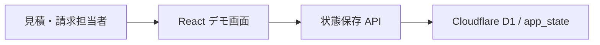

# 見積・請求デモシステム システム設計書

- 文書版: 0.2
- 更新日: 2026-09-06
- 入力要件版: 0.4（デモ実装範囲で承認済み）
- 状態: 承認済み（デモ実装用）
- 責任者: Codex

## 1. 設計方針とシステム境界

本版は、要件の主要業務を操作して確認できるデモを対象とする。参考システムの見積編集・費用区分・マスタ管理の考え方を踏襲し、単一画面内で「見積一覧」「見積編集」「請求書」「マスタ」を切り替える。

- フロントエンド: React / vinext。PC中心のレスポンシブ画面。
- 永続化: Cloudflare D1。デモ全体の状態を1つのJSON文書として保存する。
- 金額: 税別・円単位。`明細金額 = 数量 × (材料費 + 労務費)`、場所小計と全体合計は明細金額の合計。
- 請求書: 1見積につき1請求書、請求先は顧客会社。見積作成時点の明細・金額を複製する。
- 並べ替え: 同一場所内の見積明細をHTML Drag and Dropで並べ替え、キーボード操作用の上下ボタンも提供する。
- デモ制約: 認証、複数見積の合算請求、PDF出力、税・入金管理、監査履歴は対象外。

## 2. システム構成

## 3. 画面・操作・状態設計

| 画面 | 主な操作 | 状態・例外 |
| --- | --- | --- |
| ダッシュボード | 見積件数、請求件数、総額、最近の見積を確認 | データなし時は新規作成導線を表示 |
| 見積一覧 | 住所部分一致検索、新規作成、編集、請求書作成 | 0件時は該当なし表示 |
| 見積編集 | 顧客・件名・工事住所、場所追加、必須材料自動反映、工事項目選択、手入力、数量・費用編集、D&D並べ替え、保存 | 必須値不足は保存前に表示。保存中・成功・失敗を通知 |
| 請求書一覧 | 作成済み請求書を会社別に確認 | 0件時は見積から作成する導線を表示 |
| 請求書編集 | 見積情報を確認、請求日・支払期限を入力、保存 | 元見積は識別可能。元見積変更とは自動同期しない |
| 請求書プレビュー | 宛先、請求情報、工事件名、全明細、請求合計を帳票形式で確認 | 一覧へ戻る操作を提供。デモでは印刷・PDF出力なし |
| マスタ | 会社、顧客、工事、汎用、場所別必須材料を閲覧・追加 | デモでは削除・詳細権限管理は簡略化 |

## 4. API・外部インターフェース

| ID | 操作 | 入力 | 出力 | 認可 | エラー・再試行 | 対応要件 |
| --- | --- | --- | --- | --- | --- | --- |
| API-001 | GET `/api/state` | なし | 全デモ状態JSON | デモ版は認証なし | DB初期化後に初期データを返す | FR-001〜FR-017 |
| API-002 | PUT `/api/state` | 全デモ状態JSON | 保存結果・更新日時 | デモ版は認証なし | 不正形式は400、DB障害は500。画面から再試行可能 | FR-001, FR-010, FR-015〜FR-017 |

## 5. データ設計

| エンティティ | 項目 | 型 | 必須 | 制約 | 保持・削除 | 説明 |
| --- | --- | --- | --- | --- | --- | --- |
| app_state | key | text | 必須 | 主キー、`demo`固定 | デモ期間中保持 | 状態識別子 |
| app_state | payload | text(JSON) | 必須 | JSONオブジェクト | 上書き保存 | companies, customers, workItems, placeTemplates, estimates, invoicesを内包 |
| app_state | updated_at | text | 必須 | ISO 8601 | 上書き | 最終更新日時 |

アプリ内の各レコードは文字列IDを持つ。見積は顧客名・住所・費用を保存時点の値として保持し、請求書は元見積の明細と総額を複製する。

## 6. 認証・認可・セキュリティ

デモ版は認証なしである。APIはJSONの型・サイズ・必須トップレベル配列を検証し、SQLはプリペアドステートメントを使用する。本番化前にNFR-003として認証、ロール別認可、所有範囲、監査ログを追加する。

## 7. 非機能設計

### 性能・容量

デモ想定は見積100件、各見積100明細以内。住所検索と集計はクライアント内で実行する。

### 可用性・バックアップ・復旧

D1に最新状態を保存する。デモ版では履歴・バックアップUIなし。保存失敗時は画面上の編集中データを維持し、再保存可能とする。

### ログ・監視・アラート

APIエラーは機密データを含めずサーバーログへ記録し、利用者には簡潔な失敗通知を表示する。

### アクセシビリティ・互換性

フォームラベル、フォーカス表示、十分な色コントラスト、ボタンによる並べ替え代替操作を設ける。Chrome系PCブラウザを主対象とし、狭い画面では1列表示へ切り替える。

## 8. 移行・展開・ロールバック

新規デモのため移行なし。D1テーブルはDrizzle migrationで作成する。ロールバックは直前のサイト版へ戻し、DBスキーマは後方互換の単一テーブルを維持する。

## 9. テスト方針

- 計算関数: 材料費、労務費、明細金額、場所小計、見積合計。
- 状態操作: 場所追加時の必須材料、重複防止、D&D後の順序保存。
- 業務フロー: 見積作成・住所検索・請求書作成・マスタ追加。
- 品質検査: lint、型検査を含むbuild、Nodeテスト、実際のAPIを含むレンダリング確認。

## 10. 要件対応表

| 要件ID | 受入条件ID | 設計箇所 | 実装箇所 | テスト観点 |
| --- | --- | --- | --- | --- |
| FR-001〜FR-004 | AC-001〜AC-005 | §3 見積編集、§5 | `app/estimate-app.tsx` | 作成・保存・場所・材料入力 |
| FR-005〜FR-008 | AC-006〜AC-009 | §3 見積編集、§1 計算 | `app/estimate-app.tsx`, `app/lib/domain.ts` | 工事選択と費用再計算 |
| FR-009〜FR-012 | AC-010〜AC-013 | §3 見積編集・マスタ | `app/estimate-app.tsx` | 手入力、マスタ、集計 |
| FR-013〜FR-014 | AC-014, AC-022〜AC-023 | §3 見積一覧・編集 | `app/estimate-app.tsx` | 確認表示、住所検索 |
| FR-015〜FR-016 | AC-024〜AC-025 | §3 請求書 | `app/estimate-app.tsx` | 見積から会社別請求書作成・保存 |
| FR-017 | AC-026〜AC-027 | §3 見積編集 | `app/estimate-app.tsx` | D&Dと再表示後の順序 |
| FR-018 | AC-028 | §3 請求書プレビュー | `app/estimate-app.tsx` | 保存内容とプレビューの全項目・金額一致 |
| NFR-001〜NFR-002 | AC-015〜AC-016 | §5, §7, §9 | `app/lib/domain.ts`, `/api/state` | 計算精度と永続化 |
| NFR-003〜NFR-007 | AC-017〜AC-021 | §6〜§9 | デモでは一部のみ | 本番化時に認証・性能・監査を追加 |

## 11. ADR・未解決事項・リスク

| ID | 内容 | 選択肢・決定 | 理由 | 影響 | 状態 |
| --- | --- | --- | --- | --- | --- |
| ADR-001 | デモ永続化 | D1に状態JSONを保存 | 短期間で主要業務を一貫して体験でき、後に正規化可能 | 同時編集・詳細検索には不向き | 承認済み（デモ） |
| ADR-002 | 請求単位 | 1見積・1顧客会社・1請求書 | ISSUE-013未確定の安全な最小単位 | 合算・分割請求なし | 承認済み（デモ） |
| ADR-003 | 並べ替え範囲 | 同一場所内のみ、上下ボタン併設 | 場所所属の意図しない変更を防ぐ | 場所間移動は編集操作で対応 | 承認済み（デモ） |
| ADR-004 | 認証 | デモ版は未実装 | UI・業務検証を優先 | 本番利用不可 | 承認済み（デモ） |

## 12. 実装順序と引き継ぎ

1. D1スキーマ・状態API・ドメイン計算を実装する。
2. ダッシュボードと見積一覧を実装する。
3. 見積編集、場所別必須材料、工事選択、手入力、並べ替えを実装する。
4. 請求書作成とマスタ画面を実装する。
5. レスポンシブ・アクセシビリティ調整、テスト、buildを実施する。

## 承認

- 承認対象版: 0.2（デモ実装用）
- 承認者: ユーザーのデモ作成指示に基づく
- 承認日: 2026-09-06
